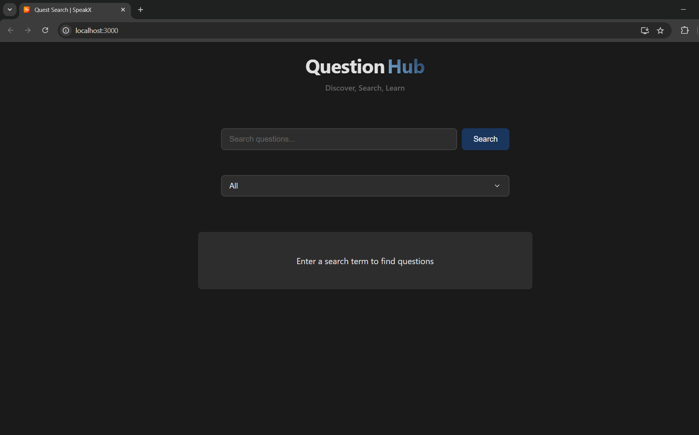
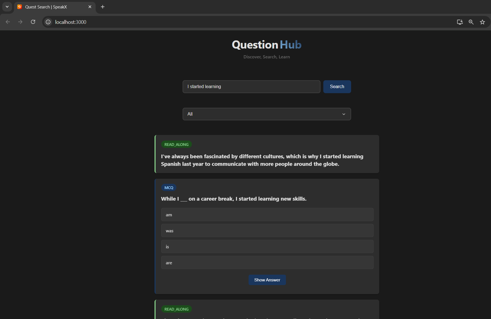
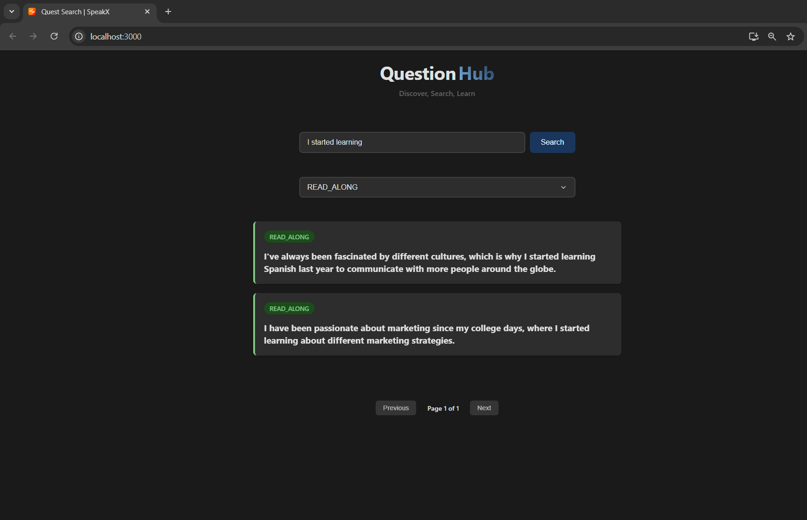

# QuestionHub

QuestionHub is an interactive platform for searching and exploring various types of educational questions, including MCQs, Anagrams, and Read-Along exercises. Built with React and Node.js, it provides a seamless experience for users to discover and interact with different question formats.

## Features

#### Advanced Search: Search questions across multiple categories
#### Filter System: Filter questions by type (MCQ, Anagram, Read-Along)
#### Responsive Design: Fully responsive interface that works on all devices
#### Dark Theme: Modern dark theme for better readability
#### Pagination: Efficient pagination system for handling large datasets

## Screenshots
### Homepage/Search Interface

### Question Display

### Filter System


## Technologies Used
## Frontend
### React.js
### Axios for API calls
### CSS3 for styling
## Backend
### Node.js
### Express.js
### MongoDB
### Mongoose
## Installation
## Prerequisites
### Node.js (v14 or higher)
### MongoDB
### npm or yarn

## Setting Up the Backend

```bash
# Clone the repository
git clone https://github.com/Rahul-0410/QuestSearch.git

# Navigate to backend directory
cd backend

# Install dependencies
npm install

# Create .env file with following variables
PORT=5000
MONGODB_URI=your_mongodb_connection_string

# Start the backend server
npm start
```

## Setting Up the Frontend

```bash
# Navigate to frontend directory
cd client

# Install dependencies
npm install

# Start the frontend development server
npm start
# The application should now be running on http://localhost:3000


```

## Contributing

Pull requests are welcome. For major changes, please open an issue first
to discuss what you would like to change.
```bash
1. Fork the repository
2. Create feature branch: git checkout -b feature/AmazingFeature
3. Commit changes: git commit -m 'Add AmazingFeature'
4. Push to branch: git push origin feature/AmazingFeature
5. Open a Pull Request
```

## License

[MIT](https://choosealicense.com/licenses/mit/)